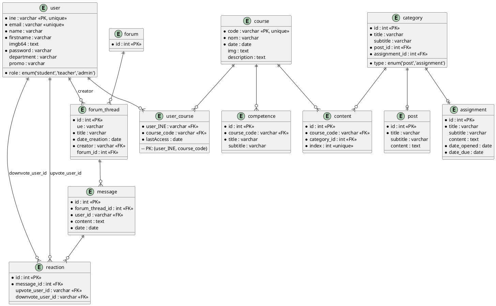

```plantuml
@startuml

entity user {
    *ine : varchar <<PK, unique>>
    *email : varchar <<unique>>
    *name : varchar
    *firstname : varchar
    *role : enum('student','teacher','admin')
    imgb64 : text
    *password : varchar
    department : varchar
    promo : varchar
}

entity course {
    *code : varchar <<PK, unique>>
    *nom : varchar
    *date : date
    img : text
    description : text
}

entity user_course {
    *user_INE : varchar <<FK>>
    *course_code : varchar <<FK>>
    *lastAccess : date
    -- PK: (user_INE, course_code)
}

entity competence {
    *id : int <<PK>>
    *course_code : varchar <<FK>>
    *title : varchar
    subtitle : varchar
}

entity content {
    *id : int <<PK>>
    *course_code : varchar <<FK>>
    *category_id : int <<FK>>
    *index : int <<unique>>
}

entity post {
    *id : int <<PK>>
    *title : varchar
    subtitle : varchar
    content : text
}

entity assignment {
    *id : int <<PK>>
    *title : varchar
    subtitle : varchar
    content : text
    *date_opened : date
    *date_due : date
}

entity category {
    *id : int <<PK>>
    *title : varchar
    subtitle : varchar
    *type : enum('post','assignment')
    *post_id : int <<FK>>
    *assignment_id : int <<FK>>
}

entity forum {
    *id : int <<PK>>
}

entity forum_thread {
    *id : int <<PK>>
    ue : varchar
    *title : varchar
    *date_creation : date
    *creator : varchar <<FK>>
    forum_id : int <<FK>>
}

entity message {
    *id : int <<PK>>
    *forum_thread_id : int <<FK>>
    *user_id : varchar <<FK>>
    *content : text
    *date : date
}

entity reaction {
    *id : int <<PK>>
    *message_id : int <<FK>>
    upvote_user_id : varchar <<FK>>
    downvote_user_id : varchar <<FK>>
}

user ||--o{ user_course : ""
course ||--o{ user_course : ""
course ||--o{ competence : ""
course ||--o{ content : ""
category ||--o{ content : ""
category ||--o| post : ""
category ||--o| assignment : ""
forum ||--o{ forum_thread : ""
forum_thread ||--o{ message : ""
user ||--o{ forum_thread : "creator"
message ||--o{ reaction : ""
user ||--o{ reaction : "upvote_user_id"
user ||--o{ reaction : "downvote_user_id"

@enduml
```