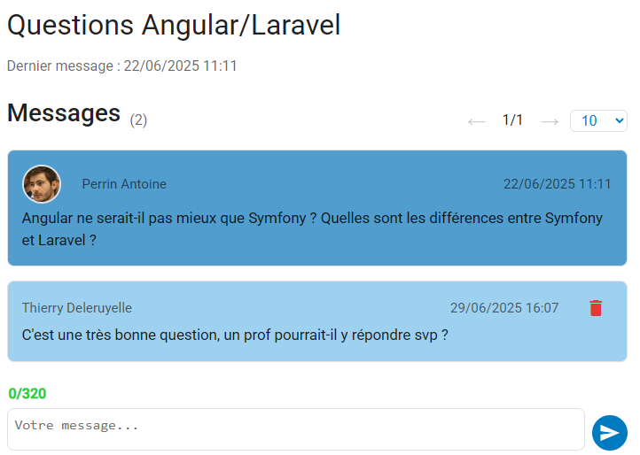

<style>
p {
  text-align: justify;
}
img {
  display: block;
  margin-left: auto;
  margin-right: auto;
  max-width: 100%;
}
h1, h2, h3, h4, h5, h6 {
  text-align: center;
  margin-top: 2em;
  margin-bottom: 1em;
  text-align: initial;
}
ul, ol {
  margin-left: 2em;
  margin-top: 0.2em;   
  margin-bottom: 0.2em;
  padding-top: 0;
  padding-bottom: 0;
}
li {
  margin-top: 0.1em;
  margin-bottom: 0.1em;
  padding-top: 0;
  padding-bottom: 0;
}
table {
  margin-left: auto;
  margin-right: auto;
}
@page {
  @bottom-center {
    content: counter(page);
  }
}
pre, code {
  max-width: 100% !important;
  width: 100% !important;
  display: block;
  box-sizing: border-box;
  font-size: 0.5em;
  line-height: 1.5;
}
</style>

<!-- -------------------------INTRO------------------------------ -->
<section data-background-image="https://chaelpixserver.ddns.net/filetransfer/data/sy43/moodle.png" style="width: 80%;">
    <br><br><br><br><br><br><br>
    <h4 style="color: black;"> Soutenance WE4B-SI40 - 30 Juin 2025 </h4>
    <p style="font-size: 0.7em; color: black;"> <i>Perrin Antoine, Arnaud Michel, Laurant Antoine </i></p>
</section>

//S

<h5>Introduction</h5>

//VS


Le projet **Moodle** est une plateforme éducative en ligne qui simplifie la gestion des cours et l'apprentissage.  
Elle propose une interface moderne et intuitive pour étudiants, enseignants et administrateurs.


<aside class="notes">
   On peut faire des notes (accessible avec la touche "s")
</aside>

//S

<h5>Technologies du Projet</h5>

//VS

## Technologies utilisées

<h3 style="font-size: 32px">Frontend : Angular & Angular Material</h3>
<ul style="font-size: 0.7em; list-style-type: none; align-items: flex-start; display: flex; flex-direction: column;">
    <li><b>Angular</b> (TypeScript) pour une interface réactive et modulaire</li>
    <li><b>Angular Material</b> pour des composants UI modernes et cohérents</li>
</ul>

<h3 style="font-size: 32px">Backend : Node.js, Express & TypeScript</h3>
<ul style="font-size: 0.7em; list-style-type: none; align-items: flex-start; display: flex; flex-direction: column;">
    <li><b>Node.js</b> pour un serveur performant et scalable</li>
    <li><b>Express</b> pour une API REST simple et efficace</li>
    <li><b>TypeScript</b> pour un code typé et maintenable</li>
</ul>

<h3 style="font-size: 32px">Base de données : MongoDB & GridFS</h3>
<ul style="font-size: 0.7em; list-style-type: none; align-items: flex-start; display: flex; flex-direction: column;">
    <li><b>MongoDB</b> pour une base de données NoSQL flexible et scalable</li>
    <li><b>GridFS</b> pour le stockage efficace des fichiers volumineux</li>
</ul>

//S

<h5>Différentes Pages</h5>

//VS

<h6>Login</h6>
    
//VS

<h6>Dashboard</h6>
    
//VS
<h6>Courses</h6>
    
//VS
<h6>Profil</h6>
    
//VS
<h6>Forums</h6>
    
//VS
<h6>Exemple d'un forum</h6>
    
//VS


//VS

<h6> Arborescence </h6>

```plaintext[1:1,2-4 | 6, 13 | 6-12 | 13 | 16-20 | 21-28, 31, 33, 35-36 | 36-47 | 48-57]
WE4B-Project
├── start-back.sh
├── start-front.sh
├── install-all.sh
├── README.md
├── backend
│   └── src
│       ├── controllers
│       ├── _devscripts
│       ├── models
│       ├── routes
│       └── services
└── frontend
    └── src
        └───app
            ├───core
            │   ├───guards
            │   ├───models
            │   ├───services
            │   └───utils
            ├───features
            │   ├───dashboard
            │   ├───forums
            │   ├───grades
            │   ├───notifications
            │   ├───others
            │   ├───page-not-found
            │   ├───admin
            │   │   └───components
            │   │       └───modals
            │   ├───profile
            │   │   └───change-password-modal
            │   ├───auth
            │   │   └───login
            │   ├───calendar
            │   ├───courses
            │   │   ├───course-detail
            │   │   │   ├───components
            │   │   │   │   ├───assignment
            │   │   │   │   ├───category
            │   │   │   │   ├───content
            │   │   │   │   ├───forum
            │   │   │   │   ├───pdf-viewer
            │   │   │   │   └───post
            │   │   │   └───modals
            │   │   ├───course-element
            │   │   └───course-list
            ├───layouts
            │   └───header
            └───shared
                └───components
                    ├───calendar
                    ├───confirmation-dialog
                    ├───edit-category-title-modal
                    ├───edit-content-modal
                    ├───file-upload
                    └───gridfs-file-upload
```


//S

<h5> Backend : Serveur, API & BDD </h5>

<aside class="notes">
    MongoDB Atlas en ligne
</aside>


//VS

<h5> API REST & Base de données </h5> <!-- (Critère : Intégration BDD) -->

<p style = "color: black; font-size:0.6em">API RESTful (Node.js/Express + TypeScript) pour toutes les interactions client-serveur.</p>
<p style = "color: black; font-size:0.6em">Base de données MongoDB Atlas avec GridFS pour le stockage de fichiers.</p>

//VS

[Modélisation base de la base données](https://rapport-si40.arnaudmichel.fr/modelisationdonnees.html#sch-ma-g-n-ral-de-la-base-de-donn-es)

//VS

<h5>Routes API Détaillées</h5>

//VS

<h6>Routes d'Authentification - /api/auth</h6>

<table class="api-table" style="width: 80%; margin: 0 auto; font-size: 0.4em;">
    <thead>
        <tr style="background-color: rgb(228, 240, 245);">
            <th style="border: 1px solid black; padding: 8px;">Endpoint</th>
            <th style="border: 1px solid black; padding: 8px;">Méthode</th>
            <th style="border: 1px solid black; padding: 8px;">Description</th>
        </tr>
    </thead>
    <tbody>
        <tr>
            <td style="border: 1px solid black; padding: 8px;">/login</td>
            <td style="border: 1px solid black; padding: 8px; background-color: #d4edda;">POST</td>
            <td style="border: 1px solid black; padding: 8px;">Connexion utilisateur avec credentials</td>
        </tr>
        <tr>
            <td style="border: 1px solid black; padding: 8px;">/logout</td>
            <td style="border: 1px solid black; padding: 8px; background-color: #d4edda;">POST</td>
            <td style="border: 1px solid black; padding: 8px;">Déconnexion utilisateur</td>
        </tr>
        <tr>
            <td style="border: 1px solid black; padding: 8px;">/check</td>
            <td style="border: 1px solid black; padding: 8px; background-color: #cce5ff;">GET</td>
            <td style="border: 1px solid black; padding: 8px;">Vérification du token d'authentification</td>
        </tr>
        <tr>
            <td style="border: 1px solid black; padding: 8px;">/verify-admin</td>
            <td style="border: 1px solid black; padding: 8px; background-color: #d4edda;">POST</td>
            <td style="border: 1px solid black; padding: 8px;">Vérification des droits administrateur</td>
        </tr>
    </tbody>
</table>

//VS

<h6>Routes Utilisateur - /api/user</h6>

<div style="display: flex; gap: 20px;">
    <div style="flex: 1;">
        <h6 style="font-size: 0.4em;">GET</h6>
        <table class="api-table" style="width: 100%; font-size: 0.4em;">
            <thead>
                <tr style="background-color: rgb(228, 240, 245);">
                    <th style="border: 1px solid black; padding: 6px;">Endpoint</th>
                    <th style="border: 1px solid black; padding: 6px;">Description</th>
                </tr>
            </thead>
            <tbody>
                <tr>
                    <td style="border: 1px solid black; padding: 6px;">/me</td>
                    <td style="border: 1px solid black; padding: 6px;">Profil utilisateur connecté</td>
                </tr>
                <tr>
                    <td style="border: 1px solid black; padding: 6px;">/admin</td>
                    <td style="border: 1px solid black; padding: 6px;">Liste tous les utilisateurs (admin)</td>
                </tr>
                <tr>
                    <td style="border: 1px solid black; padding: 6px;">/image</td>
                    <td style="border: 1px solid black; padding: 6px;">Image de profil</td>
                </tr>
                <tr>
                    <td style="border: 1px solid black; padding: 6px;">/notifications</td>
                    <td style="border: 1px solid black; padding: 6px;">Notifications utilisateur</td>
                </tr>
                <tr>
                    <td style="border: 1px solid black; padding: 6px;">/notifications/count</td>
                    <td style="border: 1px solid black; padding: 6px;">Nombre de notifications</td>
                </tr>
                <tr>
                    <td style="border: 1px solid black; padding: 6px;">/notifications/details</td>
                    <td style="border: 1px solid black; padding: 6px;">Détails des notifications</td>
                </tr>
            </tbody>
        </table>
    </div>
    <div style="flex: 1;">
        <h6 style="font-size: 0.4em;">POST/PATCH/DELETE</h6>
        <table class="api-table" style="width: 100%; font-size: 0.4em;">
            <thead>
                <tr style="background-color: rgb(228, 240, 245);">
                    <th style="border: 1px solid black; padding: 6px;">Endpoint</th>
                    <th style="border: 1px solid black; padding: 6px;">Méthode</th>
                    <th style="border: 1px solid black; padding: 6px;">Description</th>
                </tr>
            </thead>
            <tbody>
                <tr>
                    <td style="border: 1px solid black; padding: 6px;">/add</td>
                    <td style="border: 1px solid black; padding: 6px; background-color: #d4edda;">POST</td>
                    <td style="border: 1px solid black; padding: 6px;">Ajouter utilisateur</td>
                </tr>
                <tr>
                    <td style="border: 1px solid black; padding: 6px;">/update</td>
                    <td style="border: 1px solid black; padding: 6px; background-color: #fff3cd;">PATCH</td>
                    <td style="border: 1px solid black; padding: 6px;">Mettre à jour utilisateur</td>
                </tr>
                <tr>
                    <td style="border: 1px solid black; padding: 6px;">/delete</td>
                    <td style="border: 1px solid black; padding: 6px; background-color: #f8d7da;">DELETE</td>
                    <td style="border: 1px solid black; padding: 6px;">Supprimer utilisateur</td>
                </tr>
                <tr>
                    <td style="border: 1px solid black; padding: 6px;">/notifications</td>
                    <td style="border: 1px solid black; padding: 6px; background-color: #d4edda;">POST</td>
                    <td style="border: 1px solid black; padding: 6px;">Ajouter notification</td>
                </tr>
                <tr>
                    <td style="border: 1px solid black; padding: 6px;">/notifications</td>
                    <td style="border: 1px solid black; padding: 6px; background-color: #f8d7da;">DELETE</td>
                    <td style="border: 1px solid black; padding: 6px;">Supprimer toutes notifications</td>
                </tr>
                <tr>
                    <td style="border: 1px solid black; padding: 6px;">/notifications/:hash</td>
                    <td style="border: 1px solid black; padding: 6px; background-color: #f8d7da;">DELETE</td>
                    <td style="border: 1px solid black; padding: 6px;">Supprimer notification</td>
                </tr>
            </tbody>
        </table>
    </div>
</div>

//VS

<h6>Routes Cours - /api/courses</h6>

<div style="display: flex; gap: 20px;">
    <div style="flex: 1;">
        <h6 style="font-size: 0.4em;">GET</h6>
        <table class="api-table" style="width: 100%; font-size: 0.4em;">
            <thead>
                <tr style="background-color: rgb(228, 240, 245);">
                    <th style="border: 1px solid black; padding: 6px;">Endpoint</th>
                    <th style="border: 1px solid black; padding: 6px;">Description</th>
                </tr>
            </thead>
            <tbody>
                <tr>
                    <td style="border: 1px solid black; padding: 6px;">/</td>
                    <td style="border: 1px solid black; padding: 6px;">Page d'accueil (HelloWorld)</td>
                </tr>
                <tr>
                    <td style="border: 1px solid black; padding: 6px;">/all</td>
                    <td style="border: 1px solid black; padding: 6px;">Tous les cours (admin)</td>
                </tr>
                <tr>
                    <td style="border: 1px solid black; padding: 6px;">/user</td>
                    <td style="border: 1px solid black; padding: 6px;">Cours de l'utilisateur connecté</td>
                </tr>
                <tr>
                    <td style="border: 1px solid black; padding: 6px;">/codes</td>
                    <td style="border: 1px solid black; padding: 6px;">Codes des cours accessibles</td>
                </tr>
                <tr>
                    <td style="border: 1px solid black; padding: 6px;">/code/:code</td>
                    <td style="border: 1px solid black; padding: 6px;">Cours par code</td>
                </tr>
                <tr>
                    <td style="border: 1px solid black; padding: 6px;">/:_id</td>
                    <td style="border: 1px solid black; padding: 6px;">Détails d'un cours par ID</td>
                </tr>
                <tr>
                    <td style="border: 1px solid black; padding: 6px;">/:_id/users</td>
                    <td style="border: 1px solid black; padding: 6px;">Utilisateurs d'un cours</td>
                </tr>
                <tr>
                    <td style="border: 1px solid black; padding: 6px;">/:_id/participants</td>
                    <td style="border: 1px solid black; padding: 6px;">Participants d'un cours</td>
                </tr>
            </tbody>
        </table>
    </div>
    <div style="flex: 1;">
        <h6 style="font-size: 0.4em;">POST/PATCH/DELETE</h6>
        <table class="api-table" style="width: 100%; font-size: 0.4em;">
            <thead>
                <tr style="background-color: rgb(228, 240, 245);">
                    <th style="border: 1px solid black; padding: 6px;">Endpoint</th>
                    <th style="border: 1px solid black; padding: 6px;">Méthode</th>
                    <th style="border: 1px solid black; padding: 6px;">Description</th>
                </tr>
            </thead>
            <tbody>
                <tr>
                    <td style="border: 1px solid black; padding: 6px;">/add</td>
                    <td style="border: 1px solid black; padding: 6px; background-color: #d4edda;">POST</td>
                    <td style="border: 1px solid black; padding: 6px;">Créer nouveau cours</td>
                </tr>
                <tr>
                    <td style="border: 1px solid black; padding: 6px;">/delete</td>
                    <td style="border: 1px solid black; padding: 6px; background-color: #f8d7da;">DELETE</td>
                    <td style="border: 1px solid black; padding: 6px;">Supprimer cours</td>
                </tr>
                <tr>
                    <td style="border: 1px solid black; padding: 6px;">/update/:_id</td>
                    <td style="border: 1px solid black; padding: 6px; background-color: #fff3cd;">PATCH</td>
                    <td style="border: 1px solid black; padding: 6px;">Mettre à jour cours</td>
                </tr>
                <tr>
                    <td style="border: 1px solid black; padding: 6px;">/:_id/lastaccess</td>
                    <td style="border: 1px solid black; padding: 6px; background-color: #d4edda;">POST</td>
                    <td style="border: 1px solid black; padding: 6px;">Mettre à jour dernier accès</td>
                </tr>
                <tr>
                    <td style="border: 1px solid black; padding: 6px;">/:_id/register</td>
                    <td style="border: 1px solid black; padding: 6px; background-color: #d4edda;">POST</td>
                    <td style="border: 1px solid black; padding: 6px;">Inscrire utilisateurs au cours</td>
                </tr>
                <tr>
                    <td style="border: 1px solid black; padding: 6px;">/:_id/unregister</td>
                    <td style="border: 1px solid black; padding: 6px; background-color: #d4edda;">POST</td>
                    <td style="border: 1px solid black; padding: 6px;">Désinscrire utilisateurs</td>
                </tr>
            </tbody>
        </table>
    </div>
</div>

//VS

<h6>Routes Catégories - /api/categories</h6>

<div style="flex: 1;">
    <table class="api-table" style="width: 100%; font-size: 0.4em;">
        <thead>
            <tr style="background-color: rgb(228, 240, 245);">
                <th style="border: 1px solid black; padding: 4px;">Endpoint</th>
                <th style="border: 1px solid black; padding: 4px;">Méthode</th>
                <th style="border: 1px solid black; padding: 4px;">Description</th>
            </tr>
        </thead>
        <tbody>
            <tr>
                <td style="border: 1px solid black; padding: 6px;">/:courseId</td>
                <td style="border: 1px solid black; padding: 4px; background-color: #cce5ff;">GET</td>
                <td style="border: 1px solid black; padding: 6px;">Catégories d'un cours</td>
            </tr>
            <tr>
                <td style="border: 1px solid black; padding: 4px;">/add-category/:courseId</td>
                <td style="border: 1px solid black; padding: 4px; background-color: #d4edda;">POST</td>
                <td style="border: 1px solid black; padding: 4px;">Ajouter catégorie</td>
            </tr>
            <tr>
                <td style="border: 1px solid black; padding: 4px;">/modify-category/:courseId/order</td>
                <td style="border: 1px solid black; padding: 4px; background-color: #fff3cd;">PUT</td>
                <td style="border: 1px solid black; padding: 4px;">Modifier ordre catégories</td>
            </tr>
            <tr>
                <td style="border: 1px solid black; padding: 4px;">/modify-category</td>
                <td style="border: 1px solid black; padding: 4px; background-color: #fff3cd;">PUT</td>
                <td style="border: 1px solid black; padding: 4px;">Modifier catégorie</td>
            </tr>
            <tr>
                <td style="border: 1px solid black; padding: 4px;">/delete-category/:courseId</td>
                <td style="border: 1px solid black; padding: 4px; background-color: #f8d7da;">DELETE</td>
                <td style="border: 1px solid black; padding: 4px;">Supprimer catégorie</td>
            </tr>
            <tr>
                <td style="border: 1px solid black; padding: 4px;">/add-content/:categoryId</td>
                <td style="border: 1px solid black; padding: 4px; background-color: #d4edda;">POST</td>
                <td style="border: 1px solid black; padding: 4px;">Ajouter contenu</td>
            </tr>
            <tr>
                <td style="border: 1px solid black; padding: 4px;">/update-content/:contentId</td>
                <td style="border: 1px solid black; padding: 4px; background-color: #fff3cd;">PUT</td>
                <td style="border: 1px solid black; padding: 4px;">Mettre à jour contenu</td>
            </tr>
        </tbody>
    </table>
</div>

//VS

<h6>Routes Devoirs - /api/assignments</h6>

<table class="api-table" style="width: 80%; margin: 0 auto; font-size: 0.4em;">
    <thead>
        <tr style="background-color: rgb(228, 240, 245);">
            <th style="border: 1px solid black; padding: 8px;">Endpoint</th>
            <th style="border: 1px solid black; padding: 8px;">Méthode</th>
            <th style="border: 1px solid black; padding: 8px;">Description</th>
            <th style="border: 1px solid black; padding: 8px;">Auth requise</th>
        </tr>
    </thead>
    <tbody>
        <tr>
            <td style="border: 1px solid black; padding: 8px;">/</td>
            <td style="border: 1px solid black; padding: 8px; background-color: #cce5ff;">GET</td>
            <td style="border: 1px solid black; padding: 8px;">Obtenir tous les devoirs</td>
            <td style="border: 1px solid black; padding: 8px;">Non</td>
        </tr>
        <tr>
            <td style="border: 1px solid black; padding: 8px;">/:id</td>
            <td style="border: 1px solid black; padding: 8px; background-color: #cce5ff;">GET</td>
            <td style="border: 1px solid black; padding: 8px;">Obtenir devoir par ID</td>
            <td style="border: 1px solid black; padding: 8px;">Non</td>
        </tr>
        <tr>
            <td style="border: 1px solid black; padding: 8px;">/content/:id</td>
            <td style="border: 1px solid black; padding: 8px; background-color: #cce5ff;">GET</td>
            <td style="border: 1px solid black; padding: 8px;">Obtenir devoir par ID de contenu</td>
            <td style="border: 1px solid black; padding: 8px;">Non</td>
        </tr>
        <tr>
            <td style="border: 1px solid black; padding: 8px;">/</td>
            <td style="border: 1px solid black; padding: 8px; background-color: #d4edda;">POST</td>
            <td style="border: 1px solid black; padding: 8px;">Créer nouveau devoir</td>
            <td style="border: 1px solid black; padding: 8px;">Oui</td>
        </tr>
        <tr>
            <td style="border: 1px solid black; padding: 8px;">/:id</td>
            <td style="border: 1px solid black; padding: 8px; background-color: #fff3cd;">PUT</td>
            <td style="border: 1px solid black; padding: 8px;">Mettre à jour devoir</td>
            <td style="border: 1px solid black; padding: 8px;">Oui</td>
        </tr>
        <tr>
            <td style="border: 1px solid black; padding: 8px;">/:id</td>
            <td style="border: 1px solid black; padding: 8px; background-color: #f8d7da;">DELETE</td>
            <td style="border: 1px solid black; padding: 8px;">Supprimer devoir</td>
            <td style="border: 1px solid black; padding: 8px;">Oui</td>
        </tr>
    </tbody>
</table>

//VS

<h6>Routes Soumissions - /api/user-assignments</h6>

<table class="api-table" style="width: 90%; margin: 0 auto; font-size: 0.4em;">
    <thead>
        <tr style="background-color: rgb(228, 240, 245);">
            <th style="border: 1px solid black; padding: 6px;">Endpoint</th>
            <th style="border: 1px solid black; padding: 6px;">Méthode</th>
            <th style="border: 1px solid black; padding: 6px;">Description</th>
        </tr>
    </thead>
    <tbody>
        <tr>
            <td style="border: 1px solid black; padding: 6px;">/add-to-students</td>
            <td style="border: 1px solid black; padding: 6px; background-color: #d4edda;">POST</td>
            <td style="border: 1px solid black; padding: 6px;">Ajouter devoir à tous les étudiants d'un cours</td>
        </tr>
        <tr>
            <td style="border: 1px solid black; padding: 6px;">/student-assignment/:courseId/:assignmentId</td>
            <td style="border: 1px solid black; padding: 6px; background-color: #cce5ff;">GET</td>
            <td style="border: 1px solid black; padding: 6px;">Obtenir devoir d'un étudiant spécifique</td>
        </tr>
        <tr>
            <td style="border: 1px solid black; padding: 6px;">/all-students/:courseId/:assignmentId</td>
            <td style="border: 1px solid black; padding: 6px; background-color: #cce5ff;">GET</td>
            <td style="border: 1px solid black; padding: 6px;">Obtenir tous les devoirs des étudiants</td>
        </tr>
        <tr>
            <td style="border: 1px solid black; padding: 6px;">/update/:courseId/:assignmentId/:studentIne</td>
            <td style="border: 1px solid black; padding: 6px; background-color: #fff3cd;">PUT</td>
            <td style="border: 1px solid black; padding: 6px;">Mettre à jour soumission d'un étudiant</td>
        </tr>
        <tr>
            <td style="border: 1px solid black; padding: 6px;">/grades</td>
            <td style="border: 1px solid black; padding: 6px; background-color: #cce5ff;">GET</td>
            <td style="border: 1px solid black; padding: 6px;">Obtenir toutes les notes d'un étudiant</td>
        </tr>
    </tbody>
</table>

//VS

<h6>Routes Fichiers - /api/files</h6>

<div style="display: flex; gap: 20px; font-size: 0.8em;">
    <div style="flex: 1;">
        <h6 style="font-size: 0.6em;">GET</h6>
        <table class="api-table" style="width: 100%; font-size: 0.6em;">
            <thead>
                <tr style="background-color: rgb(228, 240, 245);">
                    <th style="border: 1px solid black; padding: 6px;">Endpoint</th>
                    <th style="border: 1px solid black; padding: 6px;">Description</th>
                </tr>
            </thead>
            <tbody>
                <tr>
                    <td style="border: 1px solid black; padding: 6px;">/</td>
                    <td style="border: 1px solid black; padding: 6px;">Lister fichiers avec filtres</td>
                </tr>
                <tr>
                    <td style="border: 1px solid black; padding: 6px;">/:fileId</td>
                    <td style="border: 1px solid black; padding: 6px;">Télécharger fichier par ID</td>
                </tr>
                <tr>
                    <td style="border: 1px solid black; padding: 6px;">/:fileId/metadata</td>
                    <td style="border: 1px solid black; padding: 6px;">Métadonnées d'un fichier</td>
                </tr>
                <tr>
                    <td style="border: 1px solid black; padding: 6px;">/admin/stats</td>
                    <td style="border: 1px solid black; padding: 6px;">Statistiques de stockage (admin)</td>
                </tr>
            </tbody>
        </table>
    </div>
    <div style="flex: 1;">
        <h6 style="font-size: 0.6em;">POST/PUT/DELETE</h6>
        <table class="api-table" style="width: 100%; font-size: 0.6em;">
            <thead>
                <tr style="background-color: rgb(228, 240, 245);">
                    <th style="border: 1px solid black; padding: 6px;">Endpoint</th>
                    <th style="border: 1px solid black; padding: 6px;">Méthode</th>
                    <th style="border: 1px solid black; padding: 6px;">Description</th>
                </tr>
            </thead>
            <tbody>
                <tr>
                    <td style="border: 1px solid black; padding: 6px;">/upload</td>
                    <td style="border: 1px solid black; padding: 6px; background-color: #d4edda;">POST</td>
                    <td style="border: 1px solid black; padding: 6px;">Upload fichiers (max 5)</td>
                </tr>
                <tr>
                    <td style="border: 1px solid black; padding: 6px;">/:fileId</td>
                    <td style="border: 1px solid black; padding: 6px; background-color: #f8d7da;">DELETE</td>
                    <td style="border: 1px solid black; padding: 6px;">Supprimer fichier</td>
                </tr>
                <tr>
                    <td style="border: 1px solid black; padding: 6px;">/:fileId/metadata</td>
                    <td style="border: 1px solid black; padding: 6px; background-color: #fff3cd;">PUT</td>
                    <td style="border: 1px solid black; padding: 6px;">Mettre à jour métadonnées</td>
                </tr>
            </tbody>
        </table>
    </div>
</div>

//VS

<h6>Routes Forum - /api/forum</h6>

<table class="api-table" style="width: 80%; margin: 0 auto; font-size: 0.4em;">
    <thead>
        <tr style="background-color: rgb(228, 240, 245);">
            <th style="border: 1px solid black; padding: 8px;">Endpoint</th>
            <th style="border: 1px solid black; padding: 8px;">Méthode</th>
            <th style="border: 1px solid black; padding: 8px;">Description</th>
        </tr>
    </thead>
    <tbody>
        <tr>
            <td style="border: 1px solid black; padding: 8px;">/</td>
            <td style="border: 1px solid black; padding: 8px; background-color: #cce5ff;">GET</td>
            <td style="border: 1px solid black; padding: 8px;">Obtenir tous les forums</td>
        </tr>
        <tr>
            <td style="border: 1px solid black; padding: 8px;">/:id/messages</td>
            <td style="border: 1px solid black; padding: 8px; background-color: #cce5ff;">GET</td>
            <td style="border: 1px solid black; padding: 8px;">Messages d'un forum</td>
        </tr>
        <tr>
            <td style="border: 1px solid black; padding: 8px;">/:id/messages/details</td>
            <td style="border: 1px solid black; padding: 8px; background-color: #cce5ff;">GET</td>
            <td style="border: 1px solid black; padding: 8px;">Messages avec détails utilisateur</td>
        </tr>
        <tr>
            <td style="border: 1px solid black; padding: 8px;">/</td>
            <td style="border: 1px solid black; padding: 8px; background-color: #d4edda;">POST</td>
            <td style="border: 1px solid black; padding: 8px;">Créer nouveau forum</td>
        </tr>
        <tr>
            <td style="border: 1px solid black; padding: 8px;">/:id/message</td>
            <td style="border: 1px solid black; padding: 8px; background-color: #d4edda;">POST</td>
            <td style="border: 1px solid black; padding: 8px;">Ajouter message au forum</td>
        </tr>
        <tr>
            <td style="border: 1px solid black; padding: 8px;">/:id</td>
            <td style="border: 1px solid black; padding: 8px; background-color: #f8d7da;">DELETE</td>
            <td style="border: 1px solid black; padding: 8px;">Supprimer forum</td>
        </tr>
        <tr>
            <td style="border: 1px solid black; padding: 8px;">/:id/message/:messageId</td>
            <td style="border: 1px solid black; padding: 8px; background-color: #f8d7da;">DELETE</td>
            <td style="border: 1px solid black; padding: 8px;">Supprimer message du forum</td>
        </tr>
    </tbody>
</table>

//VS

<h6>Routes Classement - /api/leaderboard</h6>

<table class="api-table" style="width: 60%; margin: 0 auto; font-size: 0.6em;">
    <thead>
        <tr style="background-color: rgb(228, 240, 245);">
            <th style="border: 1px solid black; padding: 8px;">Endpoint</th>
            <th style="border: 1px solid black; padding: 8px;">Méthode</th>
            <th style="border: 1px solid black; padding: 8px;">Description</th>
        </tr>
    </thead>
    <tbody>
        <tr>
            <td style="border: 1px solid black; padding: 8px;">/</td>
            <td style="border: 1px solid black; padding: 8px; background-color: #cce5ff;">GET</td>
            <td style="border: 1px solid black; padding: 8px;">Obtenir le classement général</td>
        </tr>
        <tr>
            <td style="border: 1px solid black; padding: 8px;">/add-score</td>
            <td style="border: 1px solid black; padding: 8px; background-color: #d4edda;">POST</td>
            <td style="border: 1px solid black; padding: 8px;">Ajouter score au classement</td>
        </tr>
    </tbody>
</table>

//S

<h5>Diagramme Architecture API</h5>
<pre>
<code class="language-plantuml">
@startuml

@enduml
</code>
</pre>


